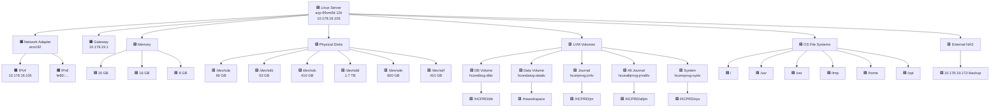

```mermaid
graph TD

%% ---------- ROOT COMPUTE ----------
A["🟦 Linux Server<br>acp-99vm0d-12k<br>10.178.19.105"]
A --> B["🟧 Network Adapter<br>ens192"]
B --> C["🟧 IPv4<br>10.178.19.105"]
B --> D["🟧 IPv6<br>fe80::..."]
A --> E["🟧 Gateway<br>10.178.19.1"]

%% ---------- MEMORY (BLUE) ----------
A --> F[🟦 Memory]
F --> F1[🟦 16 GB]
F --> F2[🟦 16 GB]
F --> F3[🟦 8 GB]

%% ---------- DISKS (GREEN) ----------
A --> G[🟩 Physical Disks]
G --> G1["🟩 /dev/sda<br>60 GB"]
G --> G2["🟩 /dev/sdb<br>53 GB"]
G --> G3["🟩 /dev/sdc<br>410 GB"]
G --> G4["🟩 /dev/sdd<br>1.7 TB"]
G --> G5["🟩 /dev/sde<br>600 GB"]
G --> G6["🟩 /dev/sdf<br>410 GB"]

%% ---------- LVM (GREEN) ----------
A --> H[🟩 LVM Volumes]
H --> H1["🟩 DB Volume<br>hcondbvg-dblv"]
H --> H2["🟩 Data Volume<br>hcondatvg-datalv"]
H --> H3["🟩 Journal<br>hconjrnvg-jrnlv"]
H --> H4["🟩 Alt Journal<br>hconaltjrnvg-jrnaltlv"]
H --> H5["🟩 System<br>hconsysvg-syslv"]

%% ---------- FILE SYSTEMS (GREEN) ----------
H1 --> I1[🟩 /HCPRD/db]
H2 --> I2[🟩 /hsworkspace]
H3 --> I3[🟩 /HCPRD/jrn]
H4 --> I4[🟩 /HCPRD/altjrn]
H5 --> I5[🟩 /HCPRD/sys]

%% ---------- OS FILE SYSTEMS (BLUE) ----------
A --> J[🟦 OS File Systems]
J --> J1[🟦 /]
J --> J2[🟦 /usr]
J --> J3[🟦 /var]
J --> J4[🟦 /tmp]
J --> J5[🟦 /home]
J --> J6[🟦 /opt]

%% ---------- NAS STORAGE (GREEN + EXTERNAL) ----------
A --> K[🟩 External NAS]
K --> K1[🟩 10.178.19.172:/backup]
```
